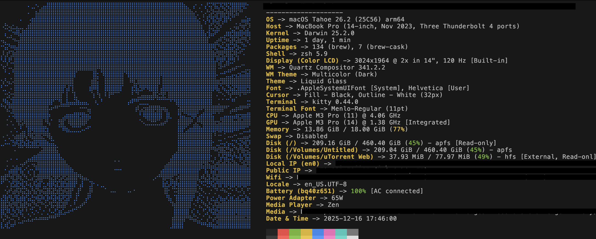

# My ZSH Configuration

Custom zsh setup with fastfetch animations and useful plugins.

## Features
- Oh My Zsh with robbyrussell theme
- Fastfetch with custom configs
- Kitty terminal startup animation
- Git plugin
- thefuck command correction
## Screenshots

### Fastfetch with Lain ASCII Art

![Launch Animation] (screenshots/eyeanimation.png)


## Prerequisites
- [Oh My Zsh](https://ohmyz.sh/)
- [Fastfetch](https://github.com/fastfetch-cli/fastfetch)
- [thefuck](https://github.com/nvbn/thefuck)
- [Kitty terminal](https://sw.kovidgoyal.net/kitty/) (optional, for startup animation)

## Installation
```bash
git clone https://github.com/iamhorribleatcoding/dotfiles.git
cd dotfiles
chmod +x install.sh
./install.sh
```

## Manual Installation
```bash
cp zshrc ~/.zshrc
source ~/.zshrc
```

